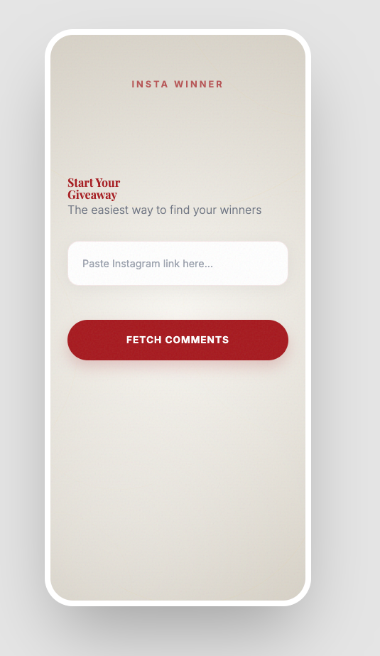
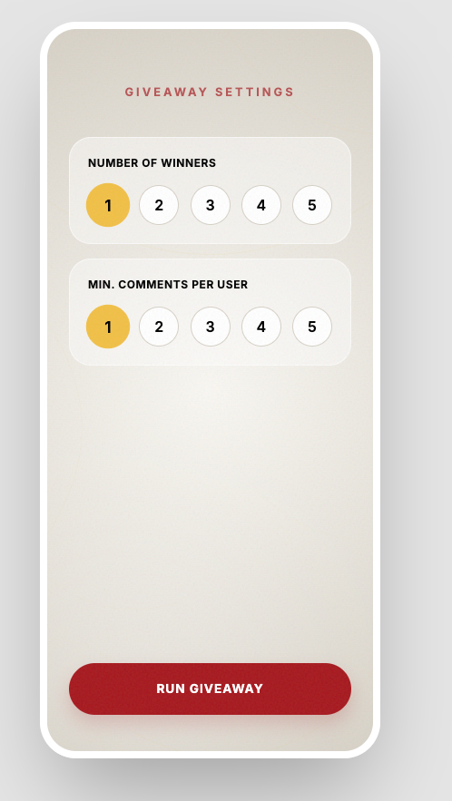
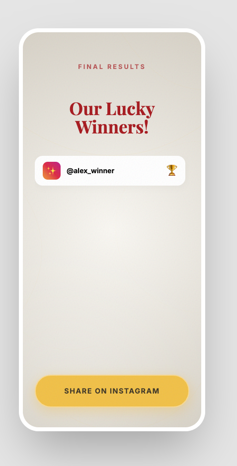

# Givegram — Instagram Giveaway Winner Picker

A web app that picks random winners from Instagram post comments. Authenticate with your Instagram session cookie, paste a post link, configure giveaway settings, and let the app randomly select winners with a suspenseful reveal animation.

## Features

- **Session-cookie authentication** — log in with your Instagram `sessionid` cookie (no password required)
- **Comment scraping** — fetch and aggregate comments from any Instagram post (`/p/`, `/reel/`, `/tv/`)
- **Configurable giveaway** — pick 1–5 winners with a minimum comment-count threshold (1–5)
- **Animated winner reveal** — countdown ring + per-winner suspense animation with unique congratulatory messages
- **Share results** — Web Share API with clipboard fallback
- **Session persistence** — credentials stored in `localStorage` with a two-tier restore strategy (validate backend session first, re-login only if needed)
- **Mobile-first responsive design**

## Screenshots

| Paste Link | Giveaway Settings | Searching | Winner Results |
|:---:|:---:|:---:|:---:|
|  |  |  |  |

## Tech Stack

- **Backend**: Python 3.12+, FastAPI, Instaloader, Pydantic v2
- **Frontend**: Vanilla HTML / CSS / JS (no framework)
- **Server**: Uvicorn (serves both API and static frontend)
- **Testing**: pytest, pytest-asyncio, httpx (100% code coverage required)
- **Linting**: ruff (format + lint), mypy (strict mode)
- **CI**: GitHub Actions (lint → test pipeline on push/PR to `main`)

## Getting Started

### Prerequisites

- Python 3.12+

### Installation

```bash
python -m venv venv
source venv/bin/activate
pip install -r requirements.txt
```

### Running

```bash
source venv/bin/activate
uvicorn backend.main:app --reload
```

Open [http://localhost:8000](http://localhost:8000) in your browser.

### Running Tests

```bash
source venv/bin/activate
pytest --cov --cov-report=term-missing
```

### Linting

```bash
ruff format . --check
ruff check . --config pyproject.toml
```

## How It Works

1. **Login** — paste your Instagram `sessionid` cookie (obtained from browser DevTools)
2. **Paste Link** — enter an Instagram post URL
3. **Settings** — choose the number of winners and minimum comments per user
4. **Searching** — animated countdown reveals each winner one by one
5. **Results** — view all winners, share results, re-run, or start a new giveaway

## Project Structure

```
givegram/
  backend/
    main.py                # FastAPI app, lifespan, endpoints, static file serving
    scraper.py             # Instagram comment scraper (instaloader) with retry logic
    models.py              # Pydantic request/response models
    winner_selector.py     # Random winner selection with eligibility filtering
    session_store.py       # In-memory session store for authenticated Instaloader instances
    tests/
      conftest.py          # Shared pytest fixtures
      test_main.py         # API endpoint tests
      test_models.py       # Pydantic model validation tests
      test_scraper.py      # Scraper unit tests
      test_session_store.py # Session store tests
      test_winner_selector.py # Winner selection tests
  frontend/
    index.html             # Single-page app with 5 screens
    css/styles.css         # Mobile-first styling
    js/app.js              # Screen navigation, API calls, animations
  .github/
    workflows/tests.yml    # CI pipeline (lint + test)
  pyproject.toml           # Project config (ruff, mypy, pytest, coverage)
  requirements.txt         # Python dependencies
```

## API Endpoints

| Method | Endpoint                 | Description                                                    |
|--------|--------------------------|----------------------------------------------------------------|
| POST   | `/api/login`             | Authenticate with an Instagram session cookie, returns session ID |
| POST   | `/api/logout`            | Invalidate a session (idempotent)                              |
| POST   | `/api/validate-session`  | Check if a backend session is still alive (no Instagram hit)   |
| POST   | `/api/fetch-comments`    | Fetch and aggregate comments from an Instagram post (authenticated) |
| POST   | `/api/pick-winners`      | Select random winners from eligible commenters                 |
